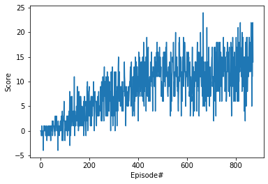

# Project 1: Navigation

[image1]: https://user-images.githubusercontent.com/10624937/42135619-d90f2f28-7d12-11e8-8823-82b970a54d7e.gif "Trained Agent"

## Learning Algorithm
This agent implements [Deep Q Network (DQN) algorithm](https://storage.googleapis.com/deepmind-media/dqn/DQNNaturePaper.pdf)

Deep Q-Learning represents action-value function q* as a neural network instaed of a table. However, when neural networks are used to represent action-value function, the reinforcement learning becomes unstable. 

Deep Q-Learning algorithm addressed the instability with following two features:

* Experience Replay: Instead of running Q-learning on state-action pairs as they occur, instead the system stores the data (state, action, reward, next_state) in a table. During, training sample of observations are used to train the agent. It gives better sampling efficiency as the correlation amongest samples is low. Thus, it smooths the learning by avoiding oscillations.

* Fixed Q-targets: The algorithm uses a target function to represent the old Q-function, that is used tp compute loss of each action during training.

### Neural network model
The objective of the model is learn or approximate function that translates 37 state values to 4 action values. We used Linear classifier with three linear layers with 1024 hidden units and relu applied on the output of each layer except last layer. 

### Epsilon
For an untrained agent, eps is kept at 0 so that it never explore by selecting random but exploit. However, for training, eps starts at  1 that allow agent to explore and then after each episode the eps decays with eps decay rate subject to minimum threshold when it exploits with maximum probability but explores with eps.

### Hyperparameters
* Buffer Size is set at 100,000 so that all experiences can be added into a memory with maximum limit of buffer size.

* Batch size is kept at 64 so that random 64 experiences are sampled from memory to train the agent.

* Gamma is kept at 0.99 so that discount factor for future rewards is 0.99

* Tau is kept at 1e-3 that is an interpolation parameter to update target network.

* Learning rate is 5e-4 that controls the weight updates for local network

* Update every is 4 that shows that after every 4 time steps experiences are sampled from memory and target network updated.

## Plot of Rewards

## Ideas for Future Work
* Learning from Pixels: The basic model learns from state space that has 37 dimensions, however, we can train the agent from pixels using convolutional neural network instaed of using linear classifier. 

* Double DQN: Since Deep Q-Learning involves learning estimates from estimates, it can overestimates action-values. An example can be a state where true Q values for all actions is 0 but estimates values are -ve for some actions and +ve for some actions. Thus, taking maximation of these estimates (+ve values) lead to overestimation of Q-values and can lead to unstable training and low quality policy. Double Q-Learning involves two estimators and each updates the other.
    -  Original Double DQN uses two independent estimates Q^{A} and Q^{B}. Estimate from Q^{A} is used with 0.5 probability but Q^{B} is updated. Similarly, estimate from Q^{B} is used but Q^{A} is updated. Thus, we obtain an unbiased estimator Q^{A}(state, argmaxQ^{next state, action) for the expected Q value and inhibit bias.
    - There are other two variations of Double DQN, refer https://towardsdatascience.com/double-deep-q-networks-905dd8325412
    
* Prioritized Experience Replay: Prioritized experience is based on the idea that some experiences can help the agent to learn effectively. Thus, some experiences should be sampled with high probability.

* Dueling DQN: In order to determine value of state, we estimate the corresponding action values for each action. However, DQN with dueling architecture can asses the value of each state without having to learn the effect of each action.  
